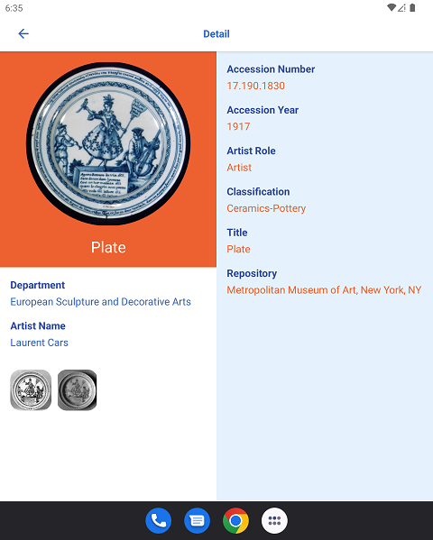
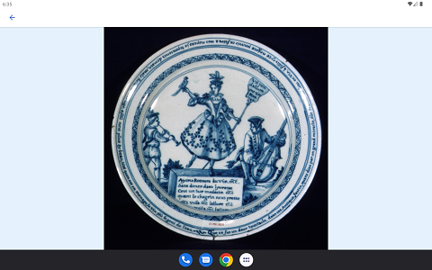

# MET
An Android app to browse through the gallery of the Metropolitan
Museum of Art (MET) using their public API.

## Tech Stack

- Kotlin
- Clean MVI Architecture
- Modular design
- Jetpack Compose
- Adaptive Layout
- Kotlin Coroutines
- Kotlin Flows
- Hilt
- Coil
- Retrofit
- Moshi
- ktlint
- TOML
- JUnit4
- mockk
- Compose Test

## Getting Started
- Clone the project 
- The branch `develop` is targeting the latest version
- Build and run the project

## Screen shots

### Phone
  

-----------------------------------

### Foldable or Tablet in portrait
  

-----------------------------------

### Foldable or Tablet in landscape or desktop
   
